# Balance Control of a Ball

###### By: Pedro Rossa

## Introduction

The objective of this project is to balance a ball on a platform (1D movement) and if the ball is moved to a different position which is not the middle(by default de desired position) of the board the machine should return it to the middle.

To do this was used an Arduino MEGA 2560, a servo motor to move the platform, a sonar to detect the position of the ball and some buttons to facilitate the adjust in the beginning of the operation, saving data and stop and start the machine.

It is possible to see the angle at which the platform is at run time due to a 4-digit, 7-segment LED display.

## Project Components

In this section is the list of all components used to do this project and the corresponding datasheets.

### Microcontroller

[Arduino MEGA 2560](https://ww1.microchip.com/downloads/en/devicedoc/atmel-2549-8-bit-avr-microcontroller-atmega640-1280-1281-2560-2561_datasheet.pdf) [(Scheme)](https://github.com/meft-sad/Balance_Control_of_a_Ball/blob/master/Manuals/Arduino_mega.png);

### Inputs 

Buttons;

### Outputs

[HDSP-B0xE](http://www.farnell.com/datasheets/2095876.pdf) :  Four digit seven segment display;

### Sensors

The sensors used in this project and corresponding datasheet are:

* [HC-SR04](https://cdn.sparkfun.com/datasheets/Sensors/Proximity/HCSR04.pdf) : Sonar to measure distances;
* [SG90](http://www.ee.ic.ac.uk/pcheung/teaching/DE1_EE/stores/sg90_datasheet.pdf) : Servo motor;
* [MPU-6050](/Datasheet/MPU-6050.pdf) : Accelerometer and gyroscope module 3 axes.

## Explaning the non-trivial components

### [HC-SR04](https://cdn.sparkfun.com/datasheets/Sensors/Proximity/HCSR04.pdf) : Sonar to measure distances

In order to measure the position of the ball in the platform it was used the HC-SR04. This sensor measures the time of an ultrasound impulse that is emitted by the Trigger pulse, travels in the air and it’s reflected by an object, in this case a ball, and arrives at the Echo pin. By using the time of the ultrasound traveled and the speed of sound in the air it's possible to measure the distance.

The sonar HC-SR04 has 4 pins: Vcc, Trigger, Echo, Ground. To put it working is needed to connect 5V to Vcc and ground to the Ground pin. The Trigger must be supplied a short 10uS pulse to start the ranging and wait 60 ms, for the wave has time to travel back to the sensor before sending another pulse, and then the module will send out an 8 cycle burst of ultrasound at 40 kHz.

The Echo pin should be connected to an input pin of the microcontroller, because in this pin after the wave is reflected on the ball it goes high for a particular amount of time, which will be equal to the time taken for the wave to return back to the sensor. The microcontroller will use an Input Capture Mode.

#### Input Capture Mode

It was used the Timer 4 of the Arduino Mega 2560 which is a 16-bits timer and it was configured with the mode Input Capture, so this timer is able to capture external events and give the time at which they occur. With this in mind it's connected the Echo of the sonar to the Pin 49 (PL0) of the Arduino, that pin corresponds to the Interrupt of timer 4 (ICP4).

Initially the Input Capture is sensitive to rising flanks because it is expected to be the beam of the reflected wave. Then the time of the ICR4 is saved in a variable (in this case T1) and then the sensing mode is changed to falling flank waiting for the wave ends and again saving the time in a variable (T2). By doing T2-T1 we would expect the time of the wave traveling to the object then being reflected and arriving at the Echo but the timer could have overflowed between the measurements. To overcome this problem, it was added an overflow interruption that corrects for this, as you can see in the following piece of code.

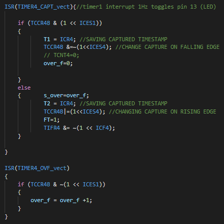

The time is given by "duration = T2-T1+65535*s_over" where s_over is all the time 0 but if an overflow occurs between T1 and T2 it's going to be 1.

#### Calculation of distance

To get the distance we need to multiply the time that the wave travels by the speed of the sound in the air and divide it by 2 because the wave travels the double of the distance of ball position, so:

distance = (duration * speed_sound)/2 [cm]

The speed of sound is 340 m/s to convert it to units that are used on the Arduino, such as microsecond, the speed of sound is equal to 0.0340 [cm/us] (29 [us/cm]) and since we are using the timer 4 with no prescaler the duration needs to be converted to microseconds, so duration*1/16 [us], so the final calculation is:

distance = duration/(29 * 2 * 16) = duration/928 [cm]

### [SG90](http://www.ee.ic.ac.uk/pcheung/teaching/DE1_EE/stores/sg90_datasheet.pdf) : Servo motor 

In the work the servo motor is used to move the platform. So, the first thing that is important to do is to estimate the torque needed to move the platform and get a motor with that or higher torque.

To calculate the torque that the motor we need to achieve a rest position (90º) putting a weight in different positions until the platform reach the balance:

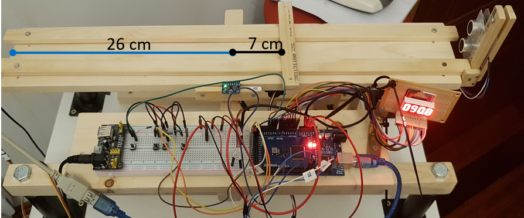

And by measure the weight of the wood block, which is approximately 8g,

is possible to calculate the torque by:

Trest = W x g x d

where W is the weight, g the gravitational acceleration constant (9.81 m/s2) and d is the distance of the wood block to the center of equilibrium.

The result is 5.4936x10-3 N.m, by checking in the datasheet the servo motor SG90 was a torque of 2.5 kg-cm this mean that the motor will stall when a weight of 2.5 kg it is hanging from a 1 cm long arm that is attached to the motor spindle,

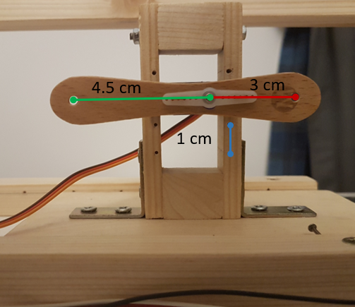

as you can see in the image aboce the armor of the motor is 3 cm so the maximum weight that the motor can handle is about 0.833 Kg and for the image bellow we can see that this motor is about 17.5 cm form the center of equilibrium of the platform do the weight that the motor will feel when attached to the platform is 3.29x10-3 kg that corresponds a form point up of 3.23x10-2 N.

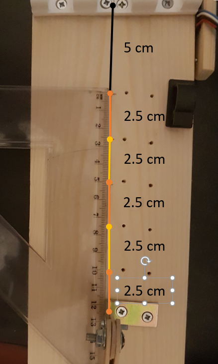

When the ball is on the platform the maximum torque that the motor will fell pointing down is about 0.0608 N.m, that means that weight of the motor will fell is about 0.0608/((26-17)x10-2x9.81)=0.069 kg.
 

On other hand the maximum torque pointing up is about 0.0718 N.m so the maximum weight that the motor will fell is about 0.081 kg. In conclusion the servo SG90 is more than enough to make the machine work.

#### How SG90 works

The SG90 is a servo motor with 3 pin, Vcc, Ground and signal(PWM).

The pin of Vcc should be connected to 4.8-6 V, in this machine has used 5 V. The ground pin is connected to the ground of the board, and to the signal pin is need to be supplied a pulse in between 1ms and 2 ms (some manufacturers say 0.5ms and 2.5ms), after that there should be a period of waiting of 20 ms for the injection of the next pulse. The pulse of 1 ms corresponds to -90º and the 2 ms to 90º so to achieve a precision of 1º the pulse has to have a precision of 0.01 ms.

For this part of the project it was used in the library of Arduino Servo because it was more complicated than thought at the beginning. The problem I think that I'm having in my function to move the servo is that I'm not waiting for the time that the servo needs to move to the desired position. This information was not in the datasheet, I only found this information when searching for a solution to my problem and found this:

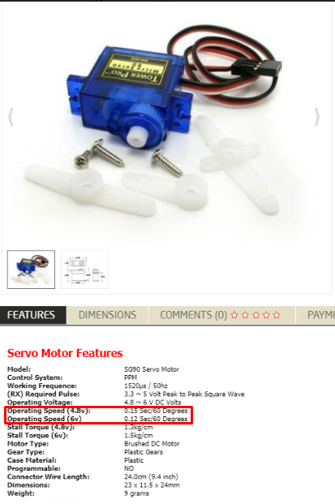

This was found a bit too late, but with this information I could correct the code, so I had to move the servo with the Servo library.

### [MPU-6050](/Datasheet/MPU-6050.pdf) : Accelerometer and gyroscope module 3 axes

The MPU-6050 was used in this work to measure the angle of the platform. This sensor uses I2C, so you have to connect the SDC and the SCL to the Arduino port's SDA and SCL, in this case the Arduino is the master and controls the MPU-6050, to facilitate this part of programming it was used the library Wire to handle the buffers.

But basically the I2C works the following way:

To read:
– Before reading data from a slave device, you must tell it
which of its internal addresses you want to read
– A read starts off by writing to the slave

Like is showed in the following piece of code:

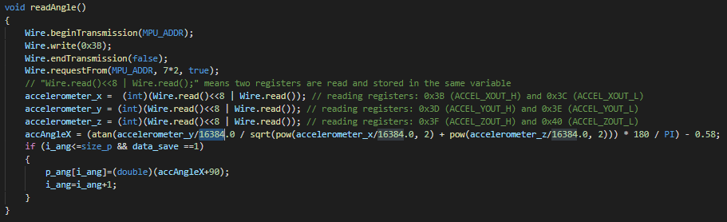

• Procedure
1. Send a start sequence
2. Send I2C address of the device with the R/W bit low (even
address)
3. Send the Internal register address
4. Send a start sequence again (repeated start)
5. Send the I2C address of the device with the R/W bit high
(odd address)
6. Read data byte from the register
7. Send the stop sequence.

The bits that the MPU-6050 send correspond to:

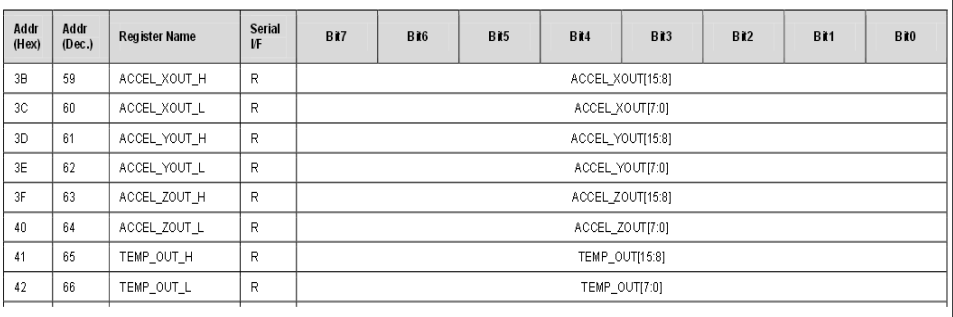

On the datasheet is told that the data raw that is needed to be divided for 16384 when the full scale range is +/- 2g so since in this case the force is so low when the platform changes I used this value.

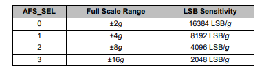

With the accelerometer measurements it's possible to get the angle by doing the following equation:

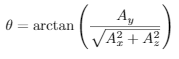

### [HDSP-B0xE](http://www.farnell.com/datasheets/2095876.pdf) :  Four digit seven segment display

To work with this type of display it is needed to send from Arduino to the HDSPBOxE 12 outputs. For that purpose, was created the following table to help to control the display:

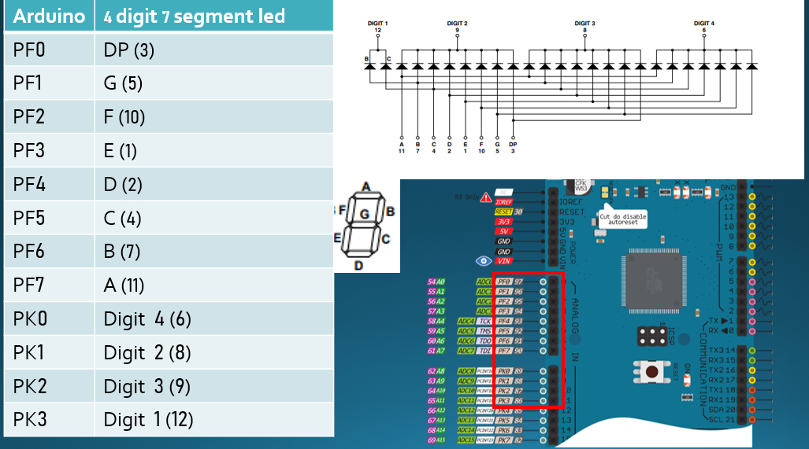

And after that using the ABC... scheme showed above it was coded the bit of the ports PF0 to PF7 to write the numbers:

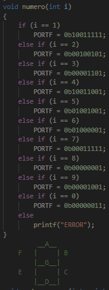

# PID

A proportional–integral–derivative controller or PID for short, continuously calculates an error value as the difference between a desired setpoint (SP), in this case is the position that we want the ball, and a measured process variable (PV) and applies a correction based on proportional, integral, and derivative terms (denoted P, I, and D respectively), hence the name.

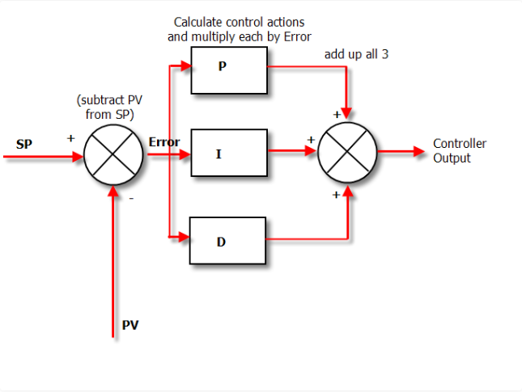

In this case the PV is given by the sonar and with the following piece of code is calculated the angle that the servo motor has to do based on the result of the PID, as you can see it is shown on the following piece of code:

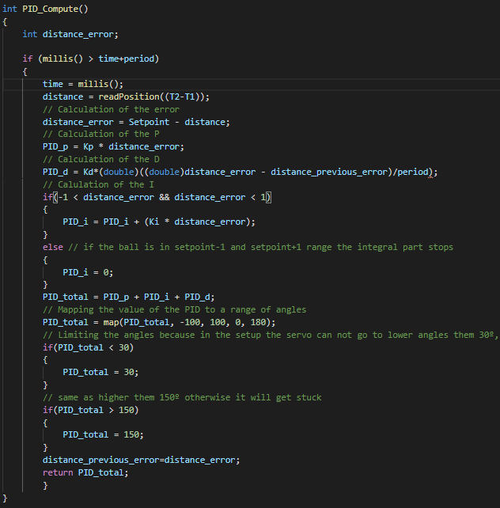

## Tuning the PID

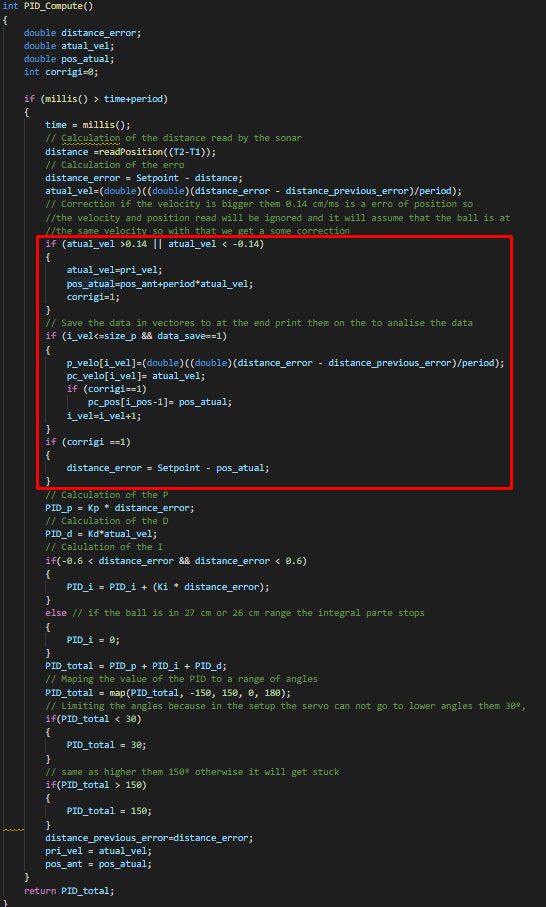

With the code for the PID written it was tuned the values for Kp, Kd and Ki. To do that I started all values at 0 and increased the Kp gain until the response to a disturbance is steady oscillation and the ball is contained on the platform, then increase the Kd gain until the oscillations go away, it's critically damped, you can see it in the following gif:

and then I increase the Ki gain until the situation that the system stabilizes the platform when it stops the ball after moving it to the setpoint.

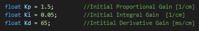

In this case the Kp is in 1/cm since it will be multiplied by a difference of position, the Ki is the same and the Kd was the units of ms/cm since it is multipled by a velocity. This is importante because since we are going to soma the PID_p, PID_d and PID_i this variable have to be dimensionless.

If the speed is calculated in cm / s instead of cm / ms, the value of Kd must be multiplied by 0.001, then the value becomes 0.065 s/cm.

## Data Analysis

After tuning the PID, the machine was tested, and it was found a problem that due to in the project we are working with a ball the sonar, when the ball is too far from the sensor, it cannot read the right position of the ball as we can see in the following graphs:

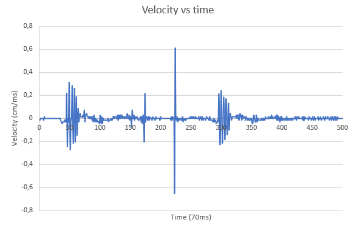

With the velocity, it was calculated the acceleration that the sensor was reading, presented in the next graph:

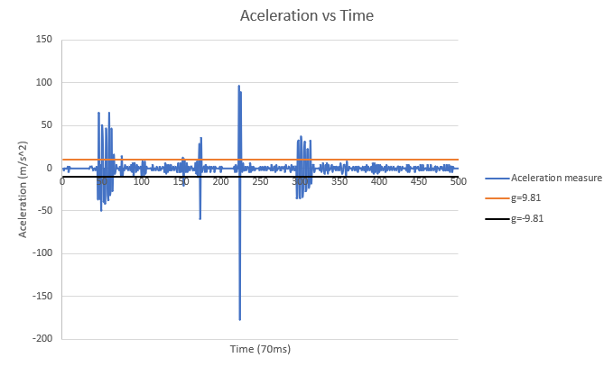

As we can see in the majority of the cases the velocity is higher than 0.14 m s-1 so the acceleration is not realistic. To solve this problem, it was written a code to help eliminate this erratic sonar reading :

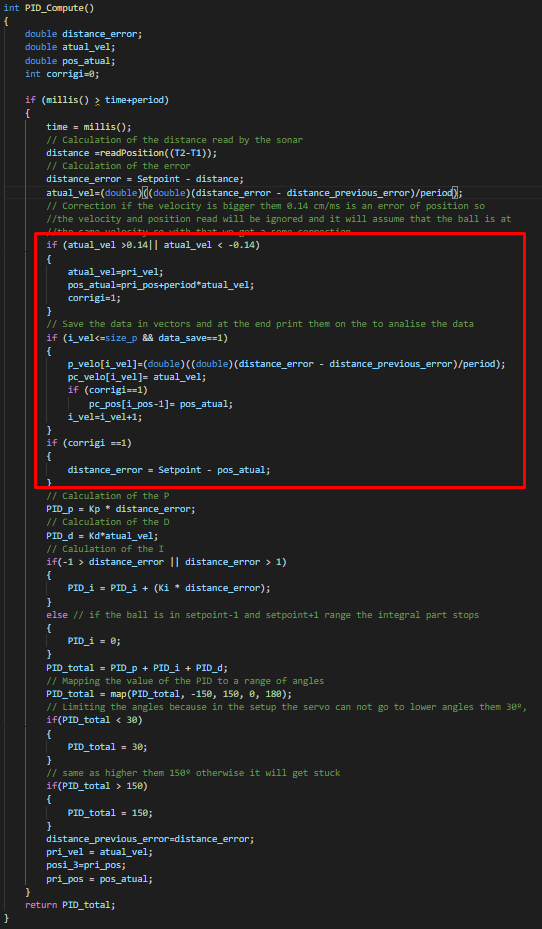

This code helps a lot to solve the problem as in the following test is possible to see:

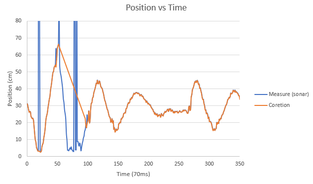

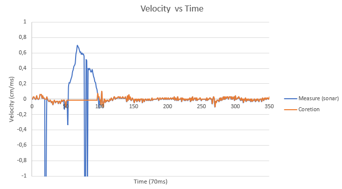

## Changing the valeu of Kd

After this the Kd value was modified to 200 ms/cm (0.2 s/cm if the velocity is calculated in cm/s) and better results were obtained, that is, the ball recovers the desired position more quickly:

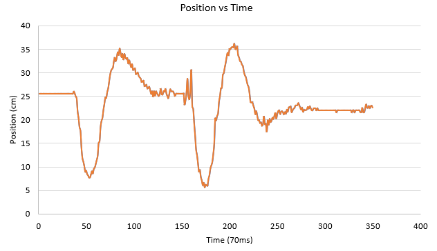

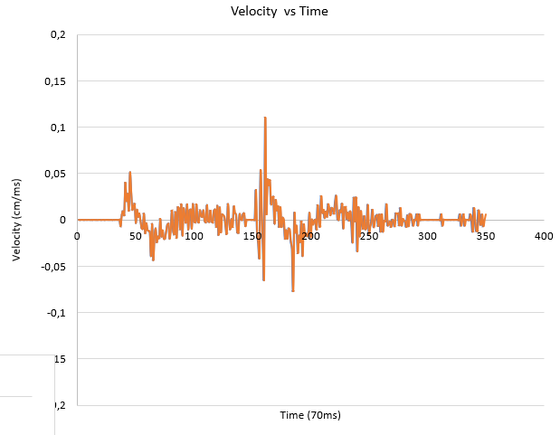

as expected incresing Kd will cause the control system to react more strongly to changes in the error parameter by increasing the speed of the overall system control response.

# Conclusion and improvements

The project was successfully carried out with all the similarities made, the bullet returned to its intended position. There are small problems when the ball moves too far away from the sonar, which is to be expected due to the spherical shape of the wave, which is difficult to reflect the wave, this is the reason why we had errors in reading the position of the ball.

A solution that could be applied in the future will be to replace the sonar with the GP2Y0A21YK sensor, which is an infrared proximity sensor, which can measure distances between 10-80 cm, so the only care we should take is placing it 10 cm off the platform.

